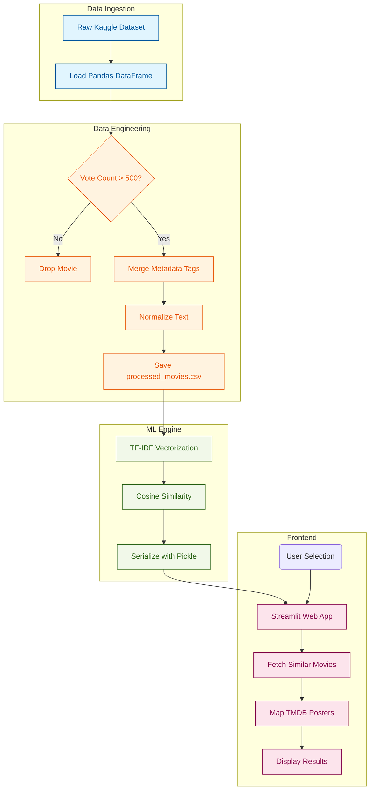

**🎬 AI Movie Recommendation System**
### TMDB Movies Dataset 2024 @kaggle


## 📝 Brief Description
This Movie Recommendation System transforms raw TMDB movie data into a rich semantic space where films are connected by meaning, not just metadata. Using advanced NLP techniques, it captures plot nuances, genre overlaps, and thematic depth to deliver highly relevant suggestions—mirroring the intelligent recommendation experience of platforms like Netflix and Amazon Prime, where every choice feels personalized and intuitive.
## 🛠️ Technology Stack

| Component | Technology | Use Case |
| :--- | :--- | :--- |
| **Language** | Python 3.10+ | Core programming and logic |
| **Data Processing** | Pandas & NumPy | Large-scale dataset cleaning and filtering |
| **Machine Learning** | Scikit-Learn | TF-IDF Vectorization and Cosine Similarity |
| **Frontend UI** | Streamlit | Interactive web interface and data rendering |
| **Serialization** | Pickle | Model saving and loading for performance |
| **Data Source** | TMDB (Kaggle) | 1M movie metadata repository |

## 🚀 Key Features
- **Massive Data Handling:** Processes the TMDB 930k+ dataset efficiently using optimized data engineering and filtering.
- **NLP Vectorization:** Utilizes `TF-IDF Vectorization` to convert movie overviews and genres into high-dimensional mathematical vectors.
- **Similarity Engine:** Implements `Cosine Similarity` (Linear Kernel) to calculate the contextual distance between movies.
- **Dynamic UI:** A sleek, dark-themed Streamlit interface featuring high-quality posters, live star ratings, and expandable overviews.

## 🎬 Output Snapshots


## 🧠 Flow Diagram
The system follows a professional Data Science pipeline to turn raw text into insights:


    
## 🛠️ Installation & Setup
1. **Clone the repo:**
   ```bash
   git clone [https://github.com/YOUR_USERNAME/movie-recommender.git](https://github.com/YOUR_USERNAME/movie-recommender.git)
   ```

2. **Install Dependencies:**
   ```bash
   pip install pandas scikit-learn streamlit
   ```

3. **Data Preprocessing:**
  ```bash
  python preprocess.py
  ```

4. **Build the Engine:**
  ```bash
  python recommender.py
  ```
  
5. **Launch the App:**
  ```bash
  streamlit run app.py
  ```

  ---

<div align="center">
  <h3>✨ Let's Connect!</h3>
  <p>Exploring the intersection of Big Data, Natural Language Processing, and Software Engineering.</p>
  
  <a href="https://github.com/keshriaman231">
    
  </a>

  <br/><br/>
  
  *"Transforming a million rows of data into a single perfect recommendation. One vector at a time."* 🚀 **[@aman-space](https://github.com/keshriaman231)**
</div>

  
